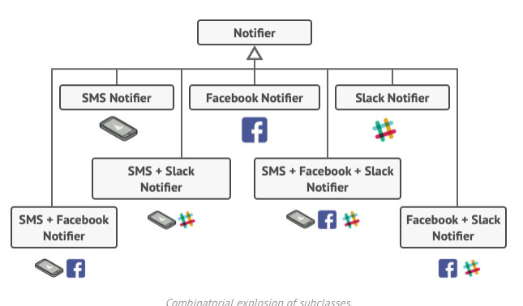

## 🔹 Bridge Pattern:
Type: Structural Pattern (like Adapter, but different intent).\
Goal: Decouple abstraction from its implementation so they can evolve independently.\
When to use:
* You have two hierarchies (abstraction & implementation) that may grow independently.\
* Example: Shape hierarchy (Circle, Square, …) and DrawingAPI hierarchy (OpenGL, DirectX, SVG, …).
## 🔹 Decorator Design Pattern
Decorator is a structural design pattern that lets you attach new behaviors to objects by placing these objects inside special wrapper objects that contain the behaviors.\

You have to find some other way to structure notifications classes so that their number won’t accidentally break some Guinness record.\
One of the ways to overcome these caveats is by using Aggregation or Composition  instead of Inheritance.
## 🔹 Facade Design Pattern
Facade is a structural design pattern that provides a simplified interface to a library, a framework, or any other complex set of classes\
In other words, it is a wrapper class used to hide the implementation details.\
lets you fit more objects into available RAM by sharing common parts of the state between multiple objects instead of storing all the data in each object individually
https://medium.com/@akshatsharma0610/facade-design-pattern-in-java-777005efc75f
https://medium.com/@rajeshvelmani/lightweight-objects-for-efficient-performance-exploring-the-flyweight-design-pattern-in-java-4595ebfa3165

## Proxy Design Pattern
Proxy is a structural design pattern that lets you provide a substitute or placeholder for another object.\
A proxy controls access to the original object, allowing you to perform something either before or after the request gets through to the original object.\
The Proxy pattern involves creating a class that acts as an intermediary between a client and a real object.\
https://medium.com/@akshatsharma0610/proxy-design-pattern-java-with-example-and-code-6b15567b8dc0
Proxy 
* Controlled access
* Caching and optimization (can have)
* Simplified interface

References for Code:
* https://github.com/geekific-official/geekific-youtube/tree/main/design-patterns
